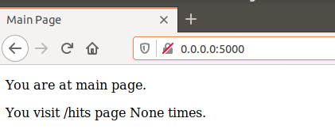
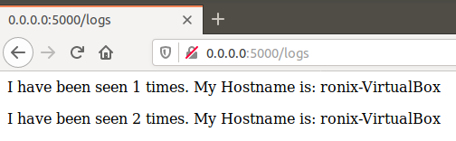
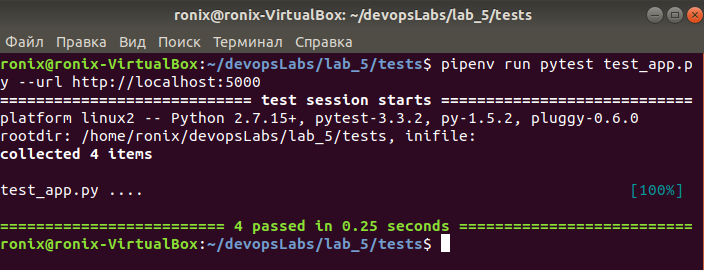
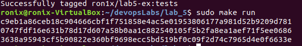
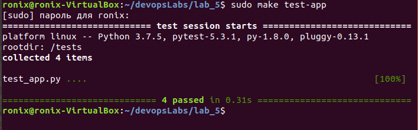
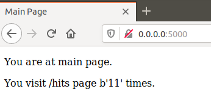
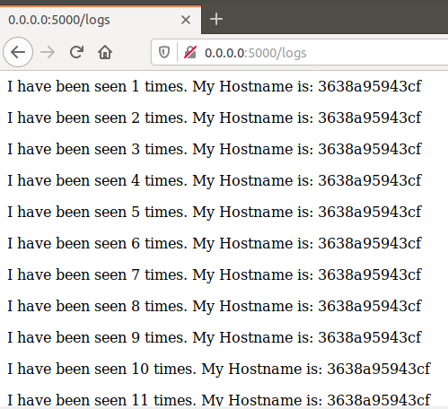
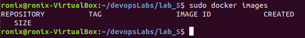

# Lab_5: Автоматизація за допомогою Makefile VS Docker Compose

## Makefile
1. Створюю папку `my_app` в якій буде знаходитись проект. Створюю папку `tests` де будуть тести на перевірку працездатності проекту. 
2. Копіюю файли з репозиторію `devops_course` у відповідні папки свого. Ознайомлююсь із вмістом кожного з файлів.
3. Пробую чи проект є працездатним перейшовши у папку та після ініціалізації середовища виконую команди записані нижче:
        `pipenv --python 3.7`
        `pipenv install -r requirements.txt`
        `pipenv run python app.py`
4. Сервер запустився, проте видав помилки `redis.exceptions.ConnectionError` Виправив помилки встановивши `redis` та прописав для нього адресу у файл `hosts`, після цього все працює.


5. Перевiрив виконання тестiв, всi тести пройшли успiшно.

6. Видаляю усі створені пiсля запуску файли.
7. Ознайомлююсь із вмістом `Dockerfile` та `Makefile` та його директивами. 
    * `STATES` та `REPO` це змінні, що містять назви тегів та назву репозиторія відповідно;
    * Директива `.PHONY` підставляє значення з змінної `STATES` та викликає директиву `$(STATES)`;
    * `$(STATES)` можна викликати просто підставляючи назву тегу і призначена для білду Docker Image;
    * `run` для запуску сайту та `redis`;
    * `test-app` для запуску тестів;
    * `docker-prune` для очищення ресурсів Docker;
8. Створюю, використовуючи команду `make` Docker імеджі для додатку та для тестів наступним чином:
    - Для додатку та тестів: `sudo make app` та `sudo make tests`.
    - Запускаю додаток `sudo make run ` та запускаю тести у новому вікні терміналу командою `sudo make test-app`.  Тести пройшли успішно, сайт також працює успішно:
    - 
    - 
    - в браузері:
    - 
    - 
9. Створив директиву в `Makefile` для завантаження створених імеджів у Docker Hub репозиторій. Завантажив імеджі до свого репозиторію:
```
    - Запушив імеджі командою `sudo make docker-push`
Створив правило в `Makefile` для видалення локальних імеджів:
```Makefile
    docker-purge:
        @docker image prune -a --force
```
   - Видалив локальні імеджі командою `sudo make docker-purge`
   - Результат `sudo docker images`:
   - 
10. Створив файл docker-compose.yml, встановив docker-compose через `pip install docker-compose`, щоб отримати останню версію. Запустив на виконання командою `docker-compose -p lab_5 up`, перейшов на сайт за посиланням зі зміненним портом: 0.0.0.0:80
11. Docker-compose створив докер імеджі, змінив у них назву репозиторію на свій.
12. Зупинив проект натиснувши `Ctrl+C` і почистив ресурси `docker-compose down`.
13. Завантажив імеджі до хабу командою `sudo docker-compose push`.
14. На мою думку обидва варіанта можна використовувати, але в залежності від поставлених задач. `Makefile` дозволяє створити власні директиви, які потім можна легко викликати однією командою, але для кожної директиви потрібна своя команда, тому `Makefile` логічно використовувати коли цих контейнерів мало. `docker-compose` дозволяє використовувати всі контейнери одночасно, але він більш громіздкий.
15. Додав файл `docker-compose.yml` для 4-ої лаби.


