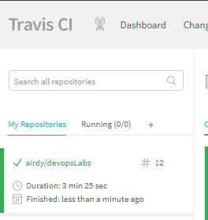

## Lab_6: Автоматизація за допомогою CI/CD серверів.
### 1. Зайшов на Travis через акаунт Github, додав репозиторій.
### 2. Додав файл .travis.yml
### 3. Виправив помилки у файлах, надав доступ скріпту Travis.
### 4. Отримав позитивний результат білда [LINK JOB](https://travis-ci.com/airdy/devopsLabs)

